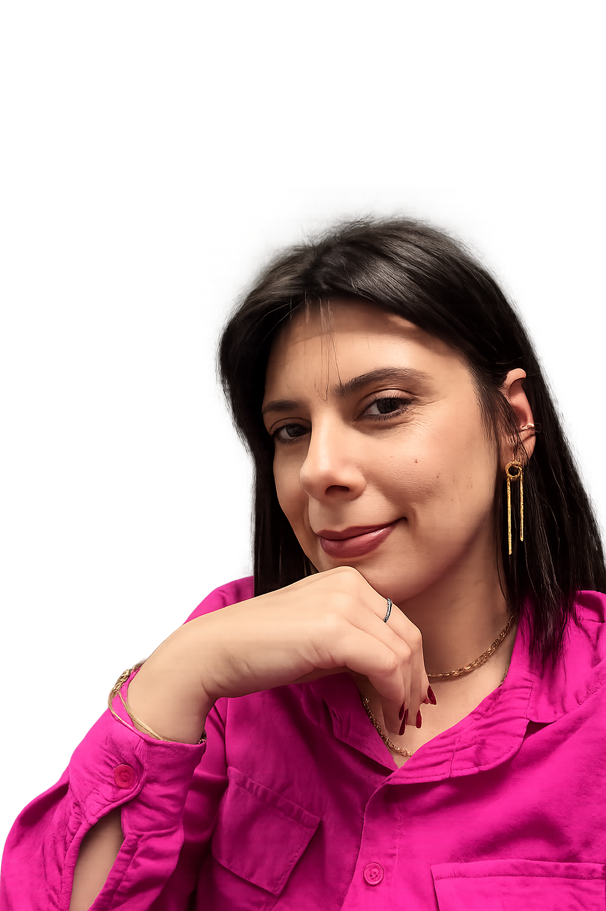
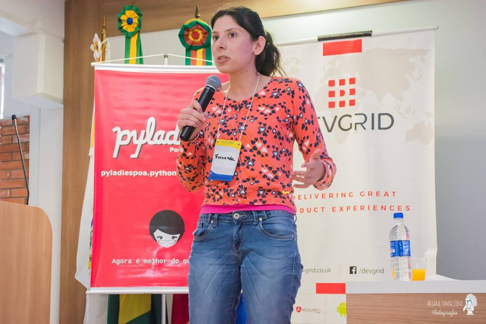

---
hide:
  - toc
  - navigation
---
<!--
CHECKLIST FOR THIS PAGE:
- [ ] Replace [YOUR NAME] with your full name (3 places)
- [ ] Replace [YOUR JOB TITLE] with your current or target role
- [ ] Replace [YOUR TAGLINE] with a short phrase describing your focus
- [ ] Rewrite the About Me paragraph with your own words
- [ ] Replace assets/images/profile.png with your actual photo (keep the filename or update it below)
- [ ] Replace assets/images/about.png with your own image (a field photo, map, or workspace shot)
- [ ] Edit the skill cards to match your actual skills (add, remove, or rename cards as needed)
- [ ] Update GitHub and LinkedIn links in the Connect section
- [ ] Add your CV PDF to docs/assets/ and update the filename in the Download CV button
-->

  
  <h1>Fernanda Oliveira da Silva</h1>
  
<strong>Engenheira Agrônoma</strong>

  
<em>Olá! Seja bem-vindo(a) ao meu portfólio. Acredito que tecnologia e dados têm o poder de transformar desafios complexos em soluções inteligentes. Sou apaixonada por programação, código limpo e pelo desenvolvimento de aplicações que unem Python, GIS, Sensoriamento Remoto e Inteligência Artificial para gerar valor em projetos de agricultura, energia e meio ambiente.</em>

---

## Sobre mim

Olá, eu sou Fernanda Oliveira

Sou Engenheira Agrônoma e Mestre em Ecossistemas Agrícolas e Naturais, com mais de 10 anos de experiência em Inteligência Geoespacial, Sensoriamento Remoto, Sistemas de Informação Geográfica (SIG) e Inteligência Artificial.

Desenvolvo soluções orientadas por dados utilizando imagens de satélite, Python, R, Machine Learning e tecnologias geoespaciais para apoiar a tomada de decisão nos setores de agricultura, energia e meio ambiente.

  

---

[View My Projects :material-arrow-right:](projects/index.md){ .md-button .md-button--primary }
[Download CV :material-download:](assets/Fernanda-CV.pdf){ .md-button }

---

## Competências Técnicas

-   :material-layers:{ .lg .middle } **SIG & Sensoriamento Remoto**

    ---

    - QGIS, ArcGIS Pro, Google Earth Engine
    - GDAL / OGR, GRASS GIS
    - Análise de imagens multiespectrais
    

-   :material-code-braces:{ .lg .middle } **Programação & Bancos de Dados**

    ---

    - Python — GeoPandas, NumPy, PySpark
    - R — sf, terra, ggplot2
    - SQL, PostgreSQL + PostGIS

-   :material-star-four-points:{ .lg .middle } **Machine Learning & GeoAI**

    ---

    - Classificação supervisionada — Random Forest, XGBoost
    - Deep Learning para segmentação 
    - scikit-learn, PyTorch, TensorFlow

-   :material-earth:{ .lg .middle } **Web Mapping & Data**

    ---

    - Armazenamento em nuvem — AWS S3
    - Formatos de dados  — GeoTIFF, GeoParquet e NetCDF
    - Streamlit for data-driven web apps

-   :material-database:{ .lg .middle } **Data & Cloud**

    ---

    - PostgreSQL + PostGIS
    - Armazenamento em nuvem: AWS S3
    - Formatos de dados geoespaciais: GeoJSON, GeoTIFF, NetCDF, Zarr e GeoParquet

-   :material-airplane:{ .lg .middle } **Drone / Processamento de dados**

    - Planejamento de missões de voo
    - Agisoft Metashape
    - OpenDroneMap
    

---

## 

[GitHub](https://github.com/FernandaFOS){ .md-button }
[LinkedIn](https://linkedin.com/in/fernanndaoliveira){ .md-button }
